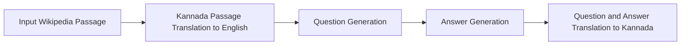

# Synthetic Question-Answer Generation over Wikipedia Documents

This notebook demonstrates how to use the `sdg` package to generate synthetic question-answer pairs using Kannada Wikipedia with Granite 3.3 2B as the teacher model. Since Granite 3.3 2B doesn't support Kannada we translate the wikipedia documents to English, generate question-answer pairs in English and translated the generated question-answer pairs back to Kannada. We will use [IndicTrans v2 translation model](https://github.com/AI4Bharat/IndicTrans2/tree/main/huggingface_interface) for the same. 

## Table of Contents
- [Overview](#overview)
- [Generation Pipeline Overview](#generation-pipeline-overview)
- [Running the Pipeline](#running-the-pipeline)
  - [Prerequisites](#Prerequisites)
  - [Generating Data](#generating-data)

## Overview

The workflow includes:

- Defining an SDG pipeline using a YAML flow file
- Creating custom SDG blocks for providing translation supprot

## Generation Pipeline Overview



### Kannada Passage Translation to English
We use IndicTrans v2, specifically `ai4bharat/indictrans2-indic-en-dist-200M` model to translate Kannada Wikipedia passages to English.

### Question Generation

* Our SDG pipeline leverages the generation capabilities of language models to generate a diverse set of question and answers based on the translated passages.

### Answer Generation

* Once we generate questions, we leverages the generation capabilities of language models to generate answer to the question grounded on the document.

### Question and Answer Translation to Kannada
We use IndicTrans v2 `ai4bharat/indictrans2-en-indic-dist-200M` model to translate generated question-answer pairs back to Kannada.

## Running the Pipeline
To run the pipeline we need to install a set of packages.

### Prerequisites
Before running the pipeline, let us install the required packages.
```bash
pip install -r requirements.txt
```

We need to start two servers one for serving the LLM and the other for serving the translation system. To start the LLM endpoint, run the command in a different terminal
```bash
vllm serve ibm-granite/granite-3.3-2b-instruct --port 8082 --max_model_len 2048
```
You can choose any LLM for serving.

Before serving the translation model, please follow the instructions [here](https://github.com/AI4Bharat/IndicTrans2/tree/main/huggingface_interface) for installing the required packages. Once installed, run the following command in a new terminal
```bash
uvicorn indic_trans_server:app --reload
```

### Generating Data
Before running the SDG pipeline, we need to create dataset which contains the documents on which question-answer pairs needs to be generated. Run the following command for the same

```bash
python create_seed_data.py
```

Now, let us run the genration pipeline
```bash
python generate.py --ds_path sdg_demo_output/seed_data.jsonl --llm_endpoint  http://0.0.0.0:8082/v1 --translation_endpoint http://127.0.0.1:8000/v1 --save_path output/generated_datapoints.jsonl --flow flows/translate_flow_knowledge.yaml --checkpoint_dir output/checkpoint_dir/ 
```

## How does the generated data look like?

#### Input Raw Document
```text
ಎಸ್.ನಿಜಲಿಂಗಪ್ಪ
ಕರ್ನಾಟಕದ ಏಕೀಕರಣಕ್ಕೆ ಹೋರಾಡಿದ ರಾಜಕಾರಣಿಗಳಲ್ಲಿ ಪ್ರಮುಖರು
```

#### Translated Document in English
```text
S. Nijalingappa
Prominent among the politicians who fought for the unification of Karnataka
```

#### Generated Question-Answer Pair
```text
Question: Who was a prominent politician known for fighting for the unification of Karnataka, as mentioned in the document?

Answer: S. Nijalingappa
```

#### Translated Question-Answer Pair
```text
Question: 
ಡಾಕ್ಯುಮೆಂಟ್ನಲ್ಲಿ ಉಲ್ಲೇಖಿಸಿರುವಂತೆ, ಕರ್ನಾಟಕದ ಏಕೀಕರಣಕ್ಕಾಗಿ ಹೋರಾಡಿದ ಪ್ರಸಿದ್ಧ ರಾಜಕಾರಣಿ ಯಾರು?

Answer:
ಎಸ್.ನಿಜಲಿಂಪ್ಪ
```

